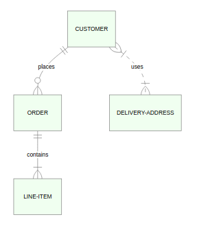
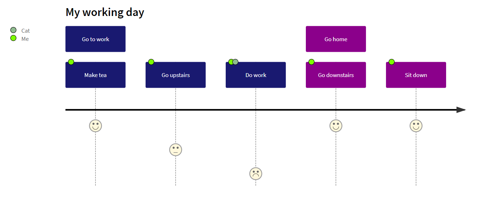

# Mermaid

[](https://travis-ci.org/mermaid-js/mermaid)
[](https://coveralls.io/github/knsv/mermaid?branch=master)
[](https://gitter.im/knsv/mermaid?utm_source=badge&utm_medium=badge&utm_campaign=pr-badge&utm_content=badge)


**Edit this Page** [](./README.md)


**Mermaid was nominated and won the JS Open Source Awards (2019) in the category "The most exciting use of technology"!!! Thanks to all involved, people committing pull requests, people answering questions and special thanks to Tyler Long who is helping me maintain the project.**


Mermaid is a tool that generates diagrams and charts, from markdown-inspired text definitions

This allows user to simplify the generation and updating of even the most complex diagrams and charts, while avoiding time-damanding and heavy tools like visio? 

mermaid, as a simple markdown-inspired script language for generating charts from text-definitions, via javascript and online. This cuts the times it takes to create, modify and render diagrams. 

Even non-programmers can use mermaid through the [mermaid live editor](https://github.com/mermaidjs/mermaid-live-editor).

For a more detailed introduction to mermaid, look [Getting Started](https://mermaid-js.github.io/mermaid/#/n00b-overview)

Check out the list of [Integrations and Usages of Mermaid](./integrations.md)


**Mermaid was nominated and won the JS Open Source Awards (2019) in the category "The most exciting use of technology"!!! Thanks to all involved, people committing pull requests, people answering questions and special thanks to Tyler Long who is helping me maintain the project.**

# Version 8.6.0 comes with 

## [New Mermaid Live-Editor Beta](https://mermaid-js.github.io/docs/mermaid-live-editor-beta/#/edit/eyJjb2RlIjoiJSV7aW5pdDoge1widGhlbWVcIjogXCJmb3Jlc3RcIiwgXCJsb2dMZXZlbFwiOiAxIH19JSVcbmdyYXBoIFREXG4gIEFbQ2hyaXN0bWFzXSAtLT58R2V0IG1vbmV5fCBCKEdvIHNob3BwaW5nKVxuICBCIC0tPiBDe0xldCBtZSB0aGlua31cbiAgQyAtLT58T25lfCBEW0xhcHRvcF1cbiAgQyAtLT58VHdvfCBFW2lQaG9uZV1cbiAgQyAtLT58VGhyZWV8IEZbZmE6ZmEtY2FyIENhcl1cblx0XHQiLCJtZXJtYWlkIjp7InRoZW1lIjoiZGFyayJ9fQ)

## [New Configuration Protocols in version 8.6.0](https://github.com/NeilCuzon/mermaid/edit/develop/docs/8.6.0_docs.md)

## [CDN](https://unpkg.com/mermaid/)

## [Documentation](https://mermaidjs.github.io)

## New diagrams in 8.5

With version 8.5 there are some bug fixes and enhancements, plus a new diagram type,  entity relationship diagrams.


## Special note regarding version 8.2

In version 8.2 a security improvement was introduced. A **securityLevel** configuration was introduced which sets the level of trust to be used on the parsed diagrams.

## securityLevel

| Parameter     | Description                       | Type   | Required | Values        |
| ------------- | --------------------------------- | ------ | -------- | ------------- |
| securitylevel | Level of trust for parsed diagram | String | Required | Strict, Loose |

\*\*Notes:

-   **strict**: (**default**) tags in text are encoded, click functionality is disabeled
-   **loose**: tags in text are allowed, click functionality is enabled


Closed issues:

⚠️ **Note** : This changes the default behaviour of mermaid so that after upgrade to 8.2, if the securityLevel is not configured, tags in flowcharts are encoded as tags and clicking is prohibited.

If your application is taking responsibility for the diagram source security you can set the securityLevel accordingly. By doing this clicks and tags are again allowed.

```javascript
mermaidAPI.initialize({
    securityLevel: 'loose'
});
```

**🖖 Keep a steady pulse: mermaid needs more Collaborators [#866](https://github.com/knsv/mermaid/issues/866)**

# Diagrams that mermaid can render:

### [Flowchart](https://mermaid-js.github.io/mermaid/#/flowchart)

```
graph TD;
    A-->B;
    A-->C;
    B-->D;
    C-->D;
```


### [Sequence diagram](https://mermaid-js.github.io/mermaid/#/sequenceDiagram)

```
sequenceDiagram
    participant Alice
    participant Bob
    Alice->>John: Hello John, how are you?
    loop Healthcheck
        John->>John: Fight against hypochondria
    end
    Note right of John: Rational thoughts <br/>prevail!
    John-->>Alice: Great!
    John->>Bob: How about you?
    Bob-->>John: Jolly good!
```


### [Gantt diagram](https://mermaid-js.github.io/mermaid/#/gantt)

```
gantt
dateFormat  YYYY-MM-DD
title Adding GANTT diagram to mermaid
excludes weekdays 2014-01-10

section A section
Completed task            :done,    des1, 2014-01-06,2014-01-08
Active task               :active,  des2, 2014-01-09, 3d
Future task               :         des3, after des2, 5d
Future task2               :         des4, after des3, 5d
```


### [Class diagram - :exclamation: experimental](https://mermaid-js.github.io/mermaid/#/classDiagram)

```
classDiagram
Class01 <|-- AveryLongClass : Cool
Class03 *-- Class04
Class05 o-- Class06
Class07 .. Class08
Class09 --> C2 : Where am i?
Class09 --* C3
Class09 --|> Class07
Class07 : equals()
Class07 : Object[] elementData
Class01 : size()
Class01 : int chimp
Class01 : int gorilla
Class08 <--> C2: Cool label
```


### Git graph - :exclamation: experimental

```
gitGraph:
options
{
    "nodeSpacing": 150,
    "nodeRadius": 10
}
end
commit
branch newbranch
checkout newbranch
commit
commit
checkout master
commit
commit
merge newbranch

```


### [Entity Relationship Diagram - :exclamation: experimental](https://mermaid-js.github.io/mermaid/#/entityRelationshipDiagram)

```
erDiagram
    CUSTOMER ||--o{ ORDER : places
    ORDER ||--|{ LINE-ITEM : contains
    CUSTOMER }|..|{ DELIVERY-ADDRESS : uses

```



### [User Journey Diagram](https://mermaid-js.github.io/mermaid/#/user-journey)

```markdown
journey
    title My working day
    section Go to work
      Make tea: 5: Me
      Go upstairs: 3: Me
      Do work: 1: Me, Cat
    section Go home
      Go downstairs: 5: Me
      Sit down: 5: Me
```


## Installation

### CDN

```
https://unpkg.com/mermaid@<version>/dist/
```

Replace `<version>` with expected version number.

Example: https://unpkg.com/mermaid@7.1.0/dist/

##Incorporating mermaid to a website
to support mermaid on your website, all you have to do is add Mermaid’s JavaScript package 

```
1.You will need to isntall node v10 or 12, which would have npm

2. download yarn using npm

2. yarn add mermaid

3. yarn add --dev mermaid
```

## To install mermaid without a bundler, one can use the script tag like so:

<script src="https://unpkg.com/mermaid/"></script>
<script>mermaid.initialize({startOnLoad:true});</script>

## it can then be followed by the diagram definitions as could be found in the examples in the documentation.


## Sibling projects
- [mermaid live editor](https://github.com/mermaidjs/mermaid-live-editor)
- [mermaid CLI](https://github.com/mermaidjs/mermaid.cli)
- [mermaid webpack demo](https://github.com/mermaidjs/mermaid-webpack-demo)
- [mermaid Parcel demo](https://github.com/mermaidjs/mermaid-parcel-demo)

## Request for assistance

Things are piling up and I have a hard time keeping up. To remedy this
it would be great if we could form a core team of developers to cooperate
with the future development of mermaid.

As part of this team you would get write access to the repository and would
represent the project when answering questions and issues.

Together we could continue the work with things like:

- Adding more types of diagrams like mindmaps, ert diagrams, etc.
- Improving existing diagrams

Don't hesitate to contact me if you want to get involved.

## For contributors

### Setup

```
yarn install
```

### Build

```
yarn build:watch
```

### Lint

```
yarn lint
```

We use [eslint](https://eslint.org/).
We recommend you installing [editor plugins](https://eslint.org/docs/user-guide/integrations) so you can get real time lint result.

### Test

```
yarn test
```
Manual test in browser: open `dist/index.html`

### Release

For those who have the permission to do so:

Update version number in `package.json`.

```
npm publish
```

Command above generates files into the `dist` folder and publishes them to npmjs.org.

## Credits

Many thanks to the [d3](http://d3js.org/) and [dagre-d3](https://github.com/cpettitt/dagre-d3) projects for providing the graphical layout and drawing libraries!

Thanks also to the [js-sequence-diagram](http://bramp.github.io/js-sequence-diagrams) project for usage of the grammar for the sequence diagrams. Thanks to Jessica Peter for inspiration and starting point for gantt rendering.

_Mermaid was created by Knut Sveidqvist for easier documentation._

_[Tyler Long](https://github.com/tylerlong) has became a collaborator since April 2017._

Here is the full list of the projects [contributors](https://github.com/knsv/mermaid/graphs/contributors).
