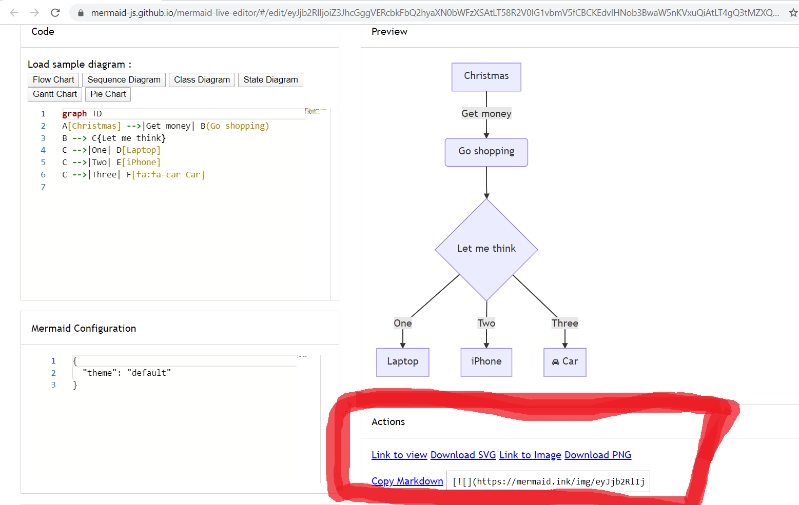
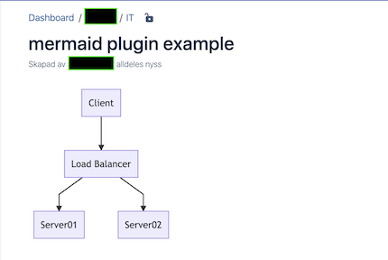

# A basic mermaid User-Guide for Beginners

Creating diagrams and charts using mermaid code is simple.
The code is turned into a diagram in the web page with the use of a mermaid renderer.

The mermaid renderer is a piece of javascript that parses mermaid definitions, when called.
This then renders a diagram based on that code in SVG, alternatively it

Most web browsers, such as Firefox, Chrome and Safari, can render mermaid, Internet Explorer however cannot.

## For beginners, there are four relatively easy ways you can use mermaid:
1. Using the mermaid [live editor](https://mermaid-js.github.io/mermaid-live-editor/). For some popular video tutorials on the live editor go to [Overview](../overview/n00b-overview.md).
2. Using one of the many [mermaid plugins](../overview/integrations.md).
3. Hosting mermaid on a webpage, with an absolute link.
4. Downloading mermaid and hosting it on your Web Page.

**Notes**: More in depth information can be found on [Usage](./usage.md).

# Following any of these examples, you can get started with creating your own diagrams using mermaid code.

## 1. The mermaid live editor:

 A great way to get started with mermaid is to visit [The mermaid live editor](https://mermaidjs.github.io/mermaid-live-editor).

In the `Code` section one can write or edit raw mermaid code, and instantly `Preview` the rendered result on the panel beside it.

**This is a great way to learn how to define a mermaid diagram.**

For some popular video tutorials on the live editor go to [Overview](../overview/n00b-overview.md).


**Notes:**

You can also click "Copy Markdown" to copy the markdown code for the diagram, that can then be pasted directly into your documentation.



The `Mermaid configuration` is for controlling mermaid behaviour. An easy introduction to mermaid configuration is found in the [Advanced usage](n00b-advanced.md) section. A complete configuration reference cataloguing default values is found on the [mermaidAPI](Setup.md) page.


## 2. Using mermaid plugins:

Thanks to the growing popularity of mermaid, many plugins already exist which incorporate a mermaid renderer. An extensive list can be found [here](../overview/integrations.md).

One example in the list is the [Atlassian Confluence mermaid plugin](https://marketplace.atlassian.com/apps/1214124/mermaid-plugin-for-confluence?hosting=server&tab=overview)

When the mermaid plugin is installed on a Confluence server, one can insert a mermaid object into any Confluence page.
### Here is a step by step process for using the mermaid-Confluence plugin:

---

- In a Confluence page, Add Other macros.


---

- Search for mermaid.


---

- The mermaid object appears. Paste your mermaid code into it.


---

- Save the page and the diagram appears.



---
## The following are two ways of hosting mermaid on a webpage.  
**This is covered in greater detail in the [Usage section](usage.md)**

## 3. Using the Mermaid API: The quick and dirty way of deploying mermaid

This method can be used with any common web server. Apache, IIS, nginx, node express [...], you pick your favourite.

We do not need to install anything on the server, apart from a program (like Notepad++) that can generate an html file, which is then deployed by a web browser (such as Firefox, Chrome, Safari, but not Internet Explorer).

So if you want to really simplify things when testing this out, don't use a web server at all but just create an HTML file locally and drag it into your browser window. The browser will do the work of rendering the mermaid diagrams according to the descriptions you've given!

### Note that all this is written in the html `<body>` section of the web page.

When writing the html file, we give the web browser three instructions inside the html code:

a. A reference for fetching the online mermaid renderer, which is written in Javascript.

b. The mermaid code for the diagram we want to create.

c. The `mermaid.initialize()` API call to start the rendering process.


## This is what needs to go into the html file (and all of them are important), for the mermaidAPI to render the diagrams:


### a. A reference to the address of the `mermaid.js` or the `mermaid.min.js` file has to be contained in a `<script src>` tag like so:

```html
<body>
  <script src="https://cdn.jsdelivr.net/npm/mermaid/dist/mermaid.min.js"></script>
</body>
```

### b. The embedded mermaid diagram definition needs to be contained inside a `<div>` tag that signifies that it is a mermaid diagram:

```html
<body>
  Here is a mermaid diagram:
  <div class="mermaid">
    graph TD
    A[Client] --> B[Load Balancer]
    B --> C[Server01]
    B --> D[Server02]
  </div>
</body>
```
**Notes**: every mermaid chart/graph/diagram definition, has to have separate `<div>` tags.

### c. The `mermaid.initialize()` API call

`mermaid.initialize()` calls take all the definitions contained in `<div class="mermaid">` tags it can find in the html body and starts to render them one by one. It is called this way:

```html
<body>
  <script>mermaid.initialize({startOnLoad:true});</script>
</body>
```
**Notes**: It is good practice to keep the `mermaid.initialize()` API call right next the `mermaid.min.js` `script` tag.
`startOnLoad` is a parameter that can optionally be changed to false, this would then prevent mermaid from immediately rendering upon loading.

### If the three steps mentioned are followed you will end up with something like this:


```html
<html>
  <body>
    <script src="https://cdn.jsdelivr.net/npm/mermaid/dist/mermaid.min.js"></script>
    <script>mermaid.initialize({startOnLoad:true});</script>

    Here is one mermaid diagram:
    <div class="mermaid">
      graph TD
      A[Client] --> B[Load Balancer]
      B --> C[Server1]
      B --> D[Server2]
    </div>

    And here is another:
    <div class="mermaid">
      graph TD
      A[Client] -->|tcp_123| B(Load Balancer)
      B -->|tcp_456| C[Server1]
      B -->|tcp_456| D[Server2]
    </div>
  </body>
</html>
```

**Notes**: This has to be saved in an `HTML` file and opened with a browser.

---
## 4. Calling mermaid from a relative link.

This method is similar to 3, if only a little more involved. The difference may be very subtle even, but it offers its own advantages, mainly in speed.

1. install node v10 or 12, which would have npm

2. download yarn using npm by entering the command below:
    npm install -g yarn

3. After yarn installs, enter the following command:
    yarn add mermaid

4. After downloading mermaid, you can then open the mermaid file you’ve downloaded and go to the `dist` folder.

5. Find the `mermaid.min.js` file,
    a. select the file.
    b. press the shift key and right click on it
    c. select copy as path from the options.

6. Paste it within the `script` tag as the `src`.
```html
<script src="Paste the mermaid.min.js file address here"></script>
<script>mermaid.initialize({startOnLoad:true});</script>
```
7. It should look something like this
```html
<script src="C:\Users\myPC\mermaid\dist\mermaid.js"></script>
<script>mermaid.initialize({startOnLoad:true});</script>
```
8. Add the graph and diagram definitions as you would in number 3.
    a. be mindful of the `div` tags.

9. Save, load/edit your HTML file to your liking.  


**Note** placing the HTML file on the same folder the `mermaid` file you've downloaded is a good practice and allows you to shorten the address on the `src` section.

**As seen here, in this full example:**
```html
<html lang="en">
<head>
  <meta charset="utf-8">
</head>
<body>
  <div class="mermaid">
  graph LR
      A --- B
      B-->C[fa:fa-ban forbidden]
      B-->D(fa:fa-spinner);
  </div>
  <div class="mermaid">
     graph TD
     A[Client] --> B[Load Balancer]
     B --> C[Server1]
     B --> D[Server2]
  </div>
  <script src="C:\Users\MyPC\mermaid\dist\mermaid.js"></script>
  <script>mermaid.initialize({startOnLoad:true});</script>
</body>
</html>
```


**Three additional comments from Knut Sveidqvist, creator of mermaid:**
- In early versions of mermaid, the `<script src>` tag was invoked in the `<head>` part of the web page. Nowadays we can place it directly in `<body>` as seen above. However, older parts of the documentation frequently reflects the previous way which still works.

- We initialize the mermaid rendering with `mermaid.initialize()` directly in the html code. In principle this could be done through placing `mermaid.initialize()` inside of `mermaid.min.js`. We would then eliminate the need for this explicit line in the html. However, there are use cases where we do want to separate the two steps. Sometimes we want full control over when we start looking for `<div>`tags inside the web page with `mermaid.initialize()`, for example when we think that all `<div>` tags may not have been loaded by the time `mermaid.min.js` runs.

- In the third method, `mermaid.min.js` is called using an absolute path. Even worse, the example includes the mermaid version number which of course will change as time goes by. However, the example makes it easy to understand what is going on - even though it is perhaps doomed in a way we do not want in a production environment. When going from testing mermaid out to getting serious with it, I would suggest one of the following approaches for calling `mermaid.min.js`:

  1. If you do not enter a specific version, you automatically get the latest one.
  2. If you really need a specific version, hard code it (this is rare but it happens).
  3. If you need to know the current mermaid version, replace a mermaid code block with the word `info` and the version will be returned like [this](https://mermaid-js.github.io/mermaid-live-editor/#/edit/eyJjb2RlIjoiaW5mb1xuXG4iLCJtZXJtYWlkIjp7InRoZW1lIjoiZGVmYXVsdCJ9fQ==)
