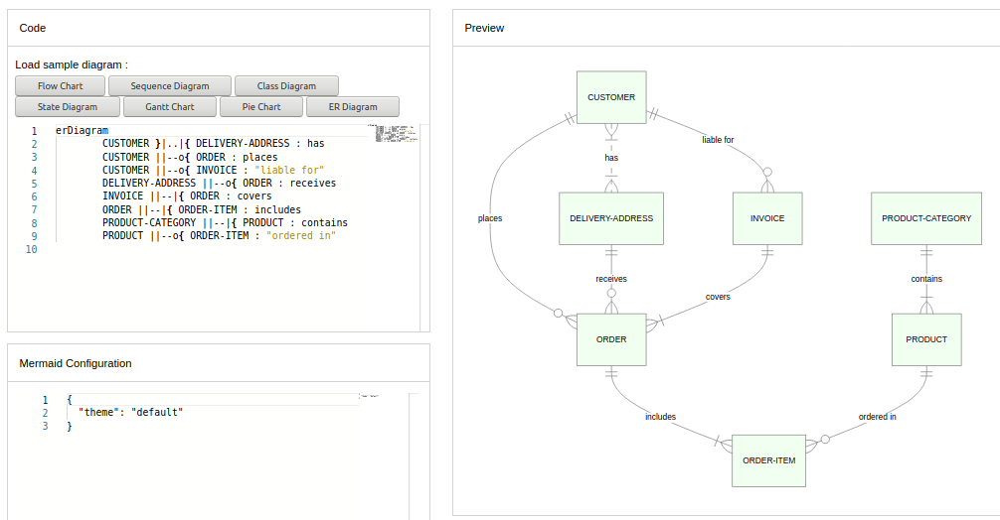

# Version News and Updates
**Edit this Page** [](https://github.com/mermaid-js/mermaid/blob/develop/docs/8.6.0_docs.md)

**This file will track the changes to mermaid and its evolution over time.**

## Here is the list of the newest versions in Descending Order, beginning from the latest version.

## [Version 8.7.0](./theming.md) brings with it a system for dynamic and integrated configuration of the diagram themes. The objective of this is to increase the customizability of mermaid and the ease of Styling, with the customization of themes through the `%%init%%` directive and `initialize` calls. 

Themes follow and build upon the Levels of Configuration and employ `directives` to modify and create custom configurations, as they were introduced in Version [8.6.0](./8.6.0_docs.md).

**These Theming Configurations, similar to directives, will also be made applicable in the Live-Editor, for easier styling.**

### Site-wide Themes
Site-wide themes are still declared via `initialize` by site owners.

Example of `Initalize` call setting `theme` to `base`:
```
    mermaidAPI.initialize({
        'securityLevel': 'loose', 'theme': 'base'
    });
```
**Notes**: Only site owners can use the `mermaidAPI.initialize` call, to set values. Site-Users will have to use `%%init%%` to modify or create the theme for their diagrams. 

### Themes at the Local or Current Level
When Generating a diagram using on a webpage that supports mermaid. It is also possible to override site-wide theme settings locally, for a specific diagram, using directives, as long as it is not prohibited by the `secure` array.

**Following is an example:**

```
%%{init: {'theme':'base'}}%%
  graph TD
    a --> b
```


### Making a Custom Theme  with `themeVariables`

The easiest way to make a custom theme is to start with the base theme, and just modify theme variables through `themeVariables`, via `%%init%%`.

|   Parameter    |                            Description                             | Type  | Required |         Objects contained          |
| -------------- | ------------------------------------------------------------------ | ----- | -------- | ---------------------------------- |
| themeVariables | Array containing objects, modifiable with the `%%init%%` directive | Array | Required | primaryColor, lineColor, textColor |


### Here is an example of overriding `primaryColor` and giving everything a different look, using `%%init%%`.
```
%%{init: {'theme': 'base', 'themeVariables': { 'primaryColor': '#ff0000'}}}%%
        graph TD
          A[Christmas] -->|Get money| B(Go shopping)
          B --> C{Let me think}
          B --> G[/Another/]
          C ==>|One| D[Laptop]
          C -->|Two| E[iPhone]
          C -->|Three| F[fa:fa-car Car]
          subgraph section
            C
            D
            E
            F
            G
          end
```


**Notes:**
Leaving it empty will set all variable values to default.


## [Version 8.6.0](./8.6.0_docs.md) introduces New Configuration Protocols and Directives and a Beta for the [New Mermaid Live-Editor](https://mermaid-js.github.io/docs/mermaid-live-editor-beta/#/edit/eyJjb2RlIjoiJSV7aW5pdDoge1widGhlbWVcIjogXCJmb3Jlc3RcIiwgXCJsb2dMZXZlbFwiOiAxIH19JSVcbmdyYXBoIFREXG4gIEFbQ2hyaXN0bWFzXSAtLT58R2V0IG1vbmV5fCBCKEdvIHNob3BwaW5nKVxuICBCIC0tPiBDe0xldCBtZSB0aGlua31cbiAgQyAtLT58T25lfCBEW0xhcHRvcF1cbiAgQyAtLT58VHdvfCBFW2lQaG9uZV1cbiAgQyAtLT58VGhyZWV8IEZbZmE6ZmEtY2FyIENhcl1cblx0XHQiLCJtZXJtYWlkIjp7InRoZW1lIjoiZGFyayJ9fQ)

**With version 8.6.0 comes the release of directives for mermaid, a new system for modifying configurations, with the aim of establishing centralized, sane defaults and simple implementation.**

directives allow for a diagram specific overriding of config, as it has been discussed in Configurations. This allows site users to input modifications to config alongside diagram definitions, when creating diagrams on a private webpage that supports mermaid.

## Version 8.5.0, introduces New diagrams

**New diagrams in 8.5**

With version 8.5 there are some bug fixes and enhancements, plus a new diagram type,  entity relationship diagrams.



## Version 8.2.0, introduces a security improvement


 A `securityLevel` configuration has to first be cleared, `securityLevel` sets the level of trust for the parsed diagrams and limits click functionality. This was introduce in version 8.2 as a security improvement, aimed at preventing malicious use. 
 
### securityLevel

| Parameter     | Description                       | Type   | Required | Values                    |
| ------------- | --------------------------------- | ------ | -------- | ------------------------- |
| securitylevel | Level of trust for parsed diagram | String | Required | Strict, Loose, antiscript |

**Notes:**

-   **strict**: (**default**) tags in text are encoded, click functionality is disabeled
-   **loose**: tags in text are allowed, click functionality is enabled
-   **antiscript**: html tags in text are allowed, (only script element is removed), click functionality is enabled


⚠️ **Note** : This changes the default behaviour of mermaid so that after upgrade to 8.2, if the `securityLevel` is not configured, tags in flowcharts are encoded as tags and clicking is prohibited.	

If you are taking resposibility for the diagram source security you can set the `securityLevel` to a value of your choosing . By doing this clicks and tags are again allowed.	

### To change `securityLevel` with `mermaidAPI.initialize`: 

```javascript	
    mermaidAPI.initialize({	
        securityLevel: 'loose'	
    });	
